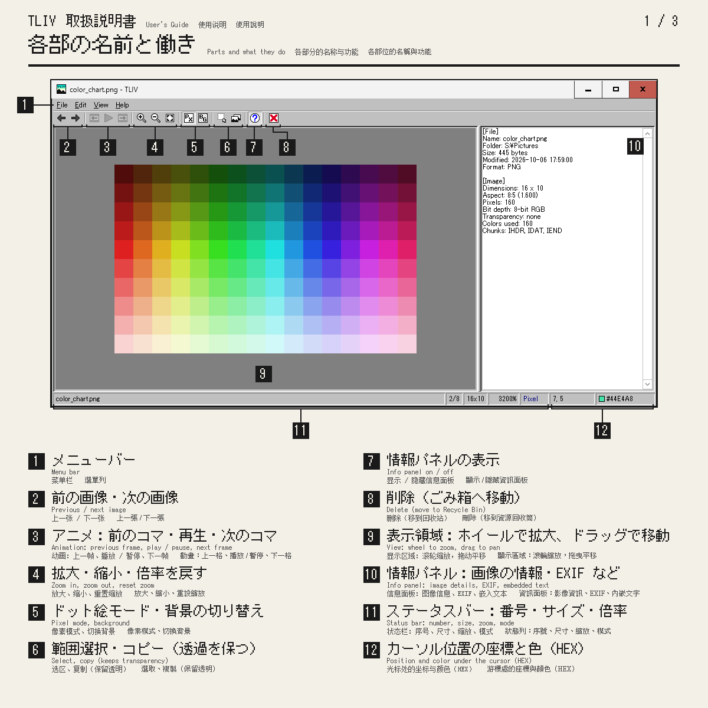
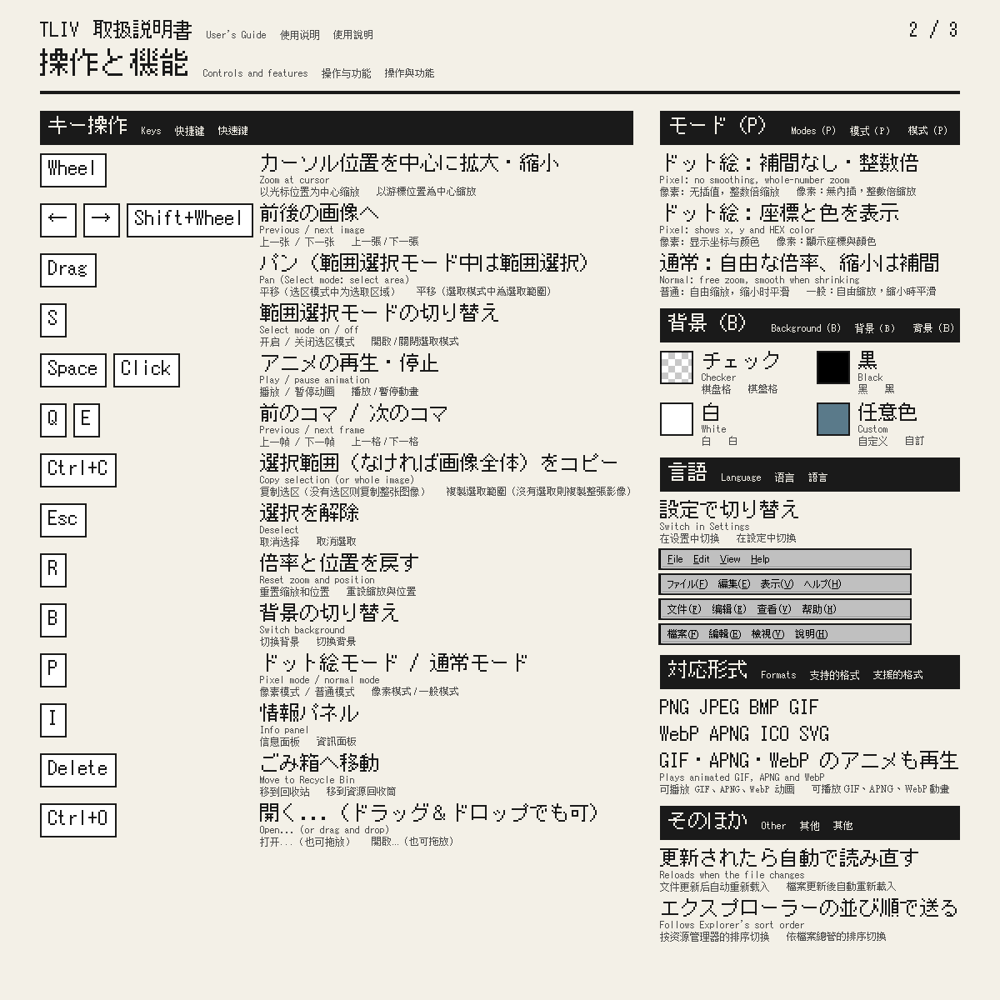
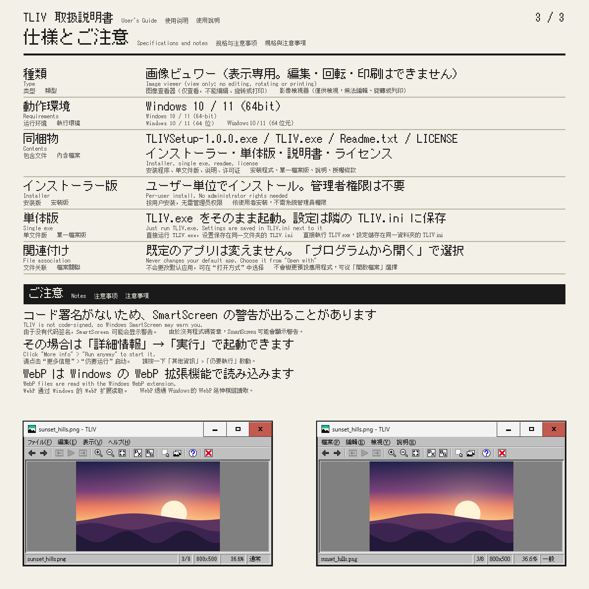

# TLIV

**A very light image viewer for Windows, made for pixel art.** It has a pixel mode (no smoothing, whole-number zoom) and a normal mode.

## Download

Get either one from GitHub Releases:

- **Installer** (`TLIVSetup-<version>.exe`): per-user, no administrator rights needed.
- **Single exe** (`TLIV.exe`): just run it. Settings are saved in `TLIV.ini` next to it.

TLIV is not code-signed, so Windows SmartScreen may warn you. Click "More info" > "Run anyway".

## Keys and mouse

| Input | Action |
|---|---|
| Wheel / Ctrl+Wheel | Zoom at cursor |
| Shift+Wheel / Left, Right | Previous / next image |
| Left drag | Pan (in Select mode: select area) |
| S | Select mode on / off (off at startup) |
| Space / Click | Play / pause animation (GIF, APNG, WebP) |
| Q / E | Previous / next frame |
| Ctrl+A | Select all |
| Ctrl+C | Copy selection (or whole image), keeps transparency |
| Esc | Deselect |
| Delete | Move to Recycle Bin (asks first) |
| R | Reset zoom and position |
| B | Background: checker / black / white / custom |
| P | Pixel mode / normal mode |
| I | Info panel (file, image and embedded text; read-only) |
| Ctrl+O | Open... |
| Ctrl+, | Settings... |

## Modes (P)

- **Pixel mode:** no smoothing, whole-number zoom steps, pixel-snapped. Shows x, y and HEX colour.
- **Normal mode:** continuous zoom, no pixel-snapping. Enlarging is never smoothed; only shrinking is smoothed (high quality).

## Language

Choose the display language in Settings: English / 日本語 / 简体中文 / 繁體中文.

## Formats / Requirements

PNG, JPEG, BMP, GIF (animated), WebP, APNG, ICO, SVG (simple). Windows 10 / 11 (x64).

## Build

- Run `build.bat` with VS 2022 Build Tools installed (`build.bat clean` for a clean build). Output: `build\TLIV.exe`.
- Run `release.bat` for the distributables in `dist\` (needs Inno Setup 6).
- If you redraw the icons in `images\`, run `build.bat icons` (needs Python 3) to regenerate `res\`.

## License

MIT. The icon artwork in `images\` is under the same license.

`src\inflate.cpp` is based on puff.c by Mark Adler (zlib license).
